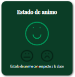

# Documentacion

Se hizo una estructura basica de archivos sobre los que ibamos a trabajar.

En el css general se agregaron estilos que compartirian todas las paginas como estos:

        @import url('https://fonts.googleapis.com/css2?family=Dosis&family=Playfair+Display&display=swap');
        *{
            margin: 0;
            padding: 0;
            box-sizing: border-box;
        }
        h1, h2{
            font-family: var(--playfair);
        }
        p{
            font-family: var(--dosis);
        }

Ademas se crearon variables con los colores y fuentes

        :root{
        --accent : #009458;
        --dark: #0b3d26;
        --hover : #69bf97;
        --gris : #ededed;
        --dosis: 'Dosis', sans-serif;
        --playfair: 'Playfair Display', serif;
        }

### Header

Se comenzo desarrollando el header y el footer ya que todas las paginas lo tenian, entonces sus estilos se agregaron en "general.css" ademas de su responsive.

### Pagina home

En esta pagina solo se agregaron dos contenedores, que son los botones principales

        

            
            <h1>Lista De Estudiantes </h1>
        

Ademas de un hover con una animacion, que se hizo con un pseudoelemento, una transformacion y una transicion

        .card a::before{
            position: absolute;
            content: "";
            inset: 0;
            margin: auto;
            background: var(--hover);
            width: 100%;
            height: 0%;
            opacity: .6;
            filter: brightness(150%);
            transition: all ease .3s;
        }

        .card a:hover h1{
            transform: scale(1.2);
        }

Solo se usaron 3 mediaquerys para el responsive

        @media (max-width: 480px) /*Mobile*/

        @media (min-width: 481px) and (max-width: 1000px) /*Tablet*/
    
        @media (max-width: 1000px) /*Mobile y Tablet estilos compartidos*/

### Animaciones

Para realizar las animaciones se usaron:
 
- keyframes
- transition
- animation

Por ejemplo para esta animacion de la cara que cambia de tamaño se uso un keyframe y la propiedad animation con un valor infinite para que siempre se ejecute

        @keyframes escalar {
            0%{
                transform: scale(1)
            }
            50%{
                transform: scale(1.2)
            }
            100%{
                transform: scale(1)
            }
        }
        /*En el objeto*/

        animation: escalar 1.8s ease infinite;

### Dinamismo

Para emular algunas acciones que deberian ser hechas con javascript o un backend se hizo uso de las "Custom Propertys" y algunos trucos de css. 
Se usaron en los checkbox para cambiar la calificacion y en el menu de seleccion de materias para cambiar los textos y las graficas 

Aunque estos tienen usos bastante limitados a comparacion de un lenguaje de programacion y requieren de un codigo extenso y poco escalable.

como veremos a continuacion se usaron estas propiedades solo para el menu:

        :root{
            --titulo_m: "Reciclaje";
            --w1: 85%;
            --w2: 70%;
            --w3: 81%;
            --w4: 35%;
            --w5: 25%;
            --t1: "85%";
            --t2: "70%";
            --t3: "81%";
            --t4: "35%";
            --t5: "25%";
            --cr: rotate(0);
        }

las cuales cambiaban su valor cuando se hacia un hover, checked o un target

        #m2:target{
            --titulo_m: "Cartografia";
            --w1: 65%;
            --w2: 70%;
            --w3: 90%;
            --w4: 55%;
            --w5: 75%;
            --t1: "65%";
            --t2: "70%";
            --t3: "90%";
            --t4: "55%";
            --t5: "75%";
            --cr: rotate(30deg);
        }

### brayan

### mardelys
